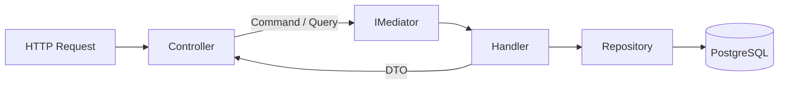
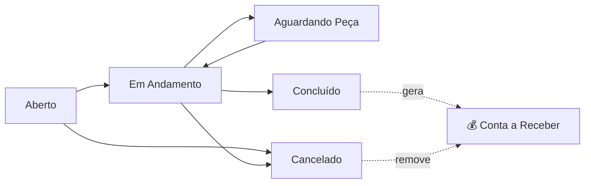
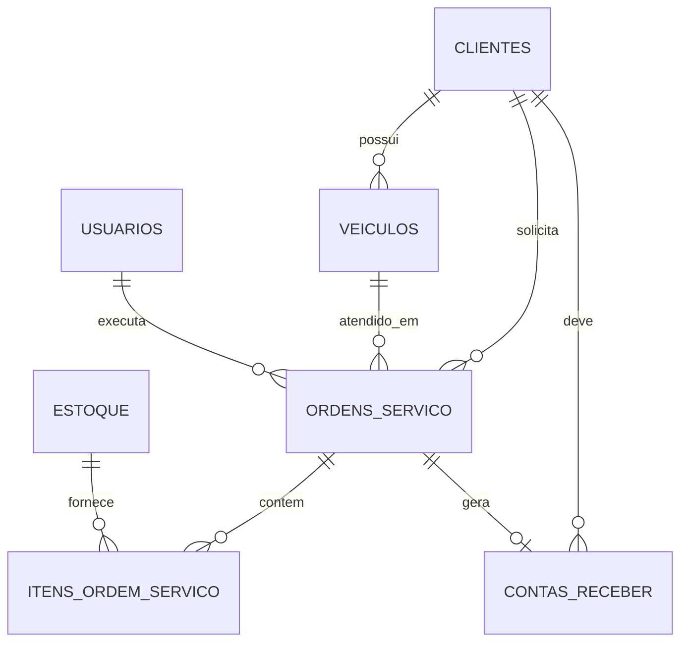

<div align="center">

# 🔧 ConnectaSys API

**SaaS de gestão para oficinas mecânicas** — clientes, veículos, ordens de serviço, estoque e financeiro em uma única API.


</div>

---

## 📑 Sumário

- [Visão geral](#-visão-geral)
- [Módulos implementados](#-módulos-implementados)
- [Stack](#-stack)
- [Arquitetura](#-arquitetura)
- [Segurança](#-segurança)
- [Como rodar](#-como-rodar)
- [Endpoints](#-endpoints)
- [Regras de negócio](#-regras-de-negócio)
- [Modelo de dados](#-modelo-de-dados)
- [Docker](#-docker)
- [Specs](#-specs-spec-driven-development)
- [Roadmap](#-roadmap)

---

## 🎯 Visão geral

A ConnectaSys API é o backend do ConnectaSys: um sistema de gestão pensado para o dia a dia de uma oficina mecânica. Ela cobre o ciclo completo do atendimento — **do cadastro do cliente e do veículo, passando pela ordem de serviço com peças baixadas do estoque, até a conta a receber gerada automaticamente na conclusão do serviço.**

Todo o domínio é modelado em português (`Cliente`, `Veiculo`, `OrdemServico`), os termos de arquitetura em inglês (`Command`, `Query`, `Handler`, `Repository`), e cada feature nasce de uma spec escrita antes do código.

---

## ✅ Módulos implementados

| Módulo | Descrição | Status |
|:--|:--|:--:|
| 🔐 **Autenticação** | Login com JWT, hash BCrypt, rate limiting por IP e por conta | ✅ |
| 🛡️ **Autorização** | Todos os endpoints protegidos com `[Authorize]`; gestão de usuários restrita a `Admin` | ✅ |
| 🧑‍🔧 **Usuários** | CRUD + roles (Admin, Mecânico, Recepcionista, Financeiro) + e-mail único | ✅ |
| 🎨 **Preferências** | Dark mode persistido por usuário (`PATCH /api/Usuarios/me/tema`) | ✅ |
| 👤 **Clientes** | CRUD + CPF/CNPJ únicos, razão social e endereço completo | ✅ |
| 🚗 **Veículos** | CRUD por cliente + tipo (Carro, Moto, Caminhão, Outros) | ✅ |
| 🧾 **Ordens de Serviço** | CRUD, itens, status, técnico responsável, desconto percentual e aprovação do cliente | ✅ |
| 📦 **Estoque** | CRUD de peças, preço de compra/venda, estoque mínimo e baixa automática pela OS | ✅ |
| 💸 **Contas a Pagar** | CRUD + forma de pagamento + status calculado | ✅ |
| 💰 **Contas a Receber** | CRUD, vínculo com OS e geração automática na conclusão do serviço | ✅ |
| 🧯 **Tratamento de erros** | Handler global de exceções, sem vazar stack trace para o cliente | ✅ |

---

## 🛠️ Stack

| Camada | Tecnologia |
|:--|:--|
| Runtime | **.NET 10** / C# |
| Banco | **PostgreSQL** via Npgsql |
| ORM | **Entity Framework Core 10** (Fluent API + Migrations) |
| Mensageria interna | **MediatR 14** (CQRS) |
| Segurança | **JWT Bearer** + **BCrypt.Net-Next** |
| Rate limiting | `Microsoft.AspNetCore.RateLimiting` + `IMemoryCache` |
| Documentação | **Swagger / Swashbuckle** |
| Container | **Docker** (multi-stage build) |

---

## 🏗️ Arquitetura

Clean Architecture em 3 projetos, com dependências apontando sempre para dentro:

```
connectasys_api.slnx
│
├── src/Core                      → Domínio + regras de aplicação (não depende de ninguém)
│   ├── Domain/Entities             → Cliente, Usuario, Veiculo, OrdemServico,
│   │                                 ItemOrdemServico, Estoque, ContaPagar, ContaReceber
│   └── Application
│       ├── Commands/               → Escrita  (Create/Update/Delete + Handlers)
│       ├── Queries/                → Leitura  (GetAll/GetById/GetBy... + Handlers)
│       ├── DTOs/                   → Contratos de saída da API
│       ├── Common/                 → Roles, StatusOrdemServico, StatusConta,
│       │                             FormasPagamento, TiposVeiculo, Temas
│       └── Interfaces/             → IRepository<T>, ITokenService, IPasswordHasher
│
├── src/Infrastructure            → Implementações concretas (depende de Core)
│   ├── Persistence/                → AppDbContext, Configurations, Migrations, Repositories
│   └── Security/                   → TokenService (JWT), PasswordHasher (BCrypt)
│
└── src/API                       → Apresentação (depende de Core + Infrastructure)
    ├── Controllers/                → Endpoints HTTP — só conhecem IMediator
    └── Program.cs                  → DI, JWT, CORS, rate limiting, Swagger, exception handler
```

### 🔄 Fluxo de uma requisição



> O Controller **nunca** acessa o `DbContext`. Ele apenas despacha um **Command** (escrita) ou **Query** (leitura) para o MediatR, que localiza o Handler responsável pela regra de negócio.

---

## 🔒 Segurança

| Proteção | Implementação |
|:--|:--|
| 🔑 **Senhas** | Hash **BCrypt** — nunca gravadas nem retornadas em texto puro (`UsuarioDto` não expõe `SenhaHash`) |
| 🎫 **Token** | JWT assinado com **HMAC-SHA256**, com claims `sub`, `email`, `name` e `role`; expiração configurável |
| 🚧 **Endpoints** | `[Authorize]` em todos os controllers; criar/editar/excluir usuário exige role **Admin** |
| 🐢 **Rate limiting** | 10 tentativas de login por IP a cada 60s + bloqueio da conta por 15 min após 5 falhas |
| 🔐 **HTTPS** | `UseHttpsRedirection` ativo, com **HSTS** fora de desenvolvimento |
| 🌐 **CORS** | Loopback liberado em dev; em produção apenas as origens de `Cors:AllowedOrigins` |
| 🙈 **Segredos** | `Jwt:Key` e senha do banco fora do repositório — via **user-secrets** ou variáveis de ambiente |
| 🧯 **Erros** | Exception handler global: loga o erro real e devolve mensagem genérica ao cliente |
| 🧬 **Postura pós-quântica** | Apenas primitivas simétricas (HMAC-SHA256, BCrypt), resistentes a Grover nos tamanhos em uso — ver `specs/specs/seguranca-quantica/` |

---

## 🚀 Como rodar

### Pré-requisitos

- [.NET SDK 10](https://dotnet.microsoft.com/download)
- [PostgreSQL](https://www.postgresql.org/download/) acessível localmente ou pela rede

### 1. Clone e restaure

```bash
git clone https://github.com/Paulocergio/connectasys_api.git
cd connectasys_api
dotnet restore
```

### 2. Configure os segredos (fora do Git)

```bash
cd src/API

dotnet user-secrets set "ConnectionStrings:DefaultConnection" \
  "Host=127.0.0.1;Port=5432;Database=ConnectaSysDb;Username=postgres;Password=SUA_SENHA"

# 256 bits aleatórios em base64
dotnet user-secrets set "Jwt:Key" "$(openssl rand -base64 32)"
```

> 💡 Em produção, use variáveis de ambiente: `ConnectionStrings__DefaultConnection`, `Jwt__Key` e `Cors__AllowedOrigins`.

### 3. Confie no certificado de desenvolvimento

```bash
dotnet dev-certs https --trust
```

### 4. Aplique as migrations

```bash
dotnet ef database update \
  --project src/Infrastructure/connectasys_api.Infrastructure.csproj \
  --startup-project src/API/connectasys_api.API.csproj
```

### 5. Rode a API

```bash
cd src/API
dotnet run
```

| Recurso | URL |
|:--|:--|
| 🌐 HTTP | `http://localhost:5283` |
| 🔐 HTTPS | `https://localhost:7074` |
| 📘 Swagger | `https://localhost:7074/swagger` |

---

## 📡 Endpoints

Todas as rotas — exceto o login — exigem o header:

```http
Authorization: Bearer <token>
```

### 🔐 Autenticação — `/api/Auth`

| Método | Rota | Descrição | Acesso |
|:--:|:--|:--|:--:|
| 🟡 `POST` | `/api/Auth/login` | Autentica e devolve o JWT, o perfil e o tema do usuário | 🌍 Público |

<details>
<summary><b>Exemplo de request/response</b></summary>

```jsonc
// POST /api/Auth/login
{ "email": "admin@oficina.com", "senha": "minha-senha" }
```

```jsonc
// 200 OK
{
  "token": "eyJhbGciOiJIUzI1NiIsInR5cCI6IkpXVCJ9...",
  "expiraEmUtc": "2026-09-09T15:30:00Z",
  "usuarioId": "9c1f...",
  "nome": "Administrador",
  "role": "Admin",
  "tema": "dark"
}
```

`401` e-mail ou senha inválidos · `429` muitas tentativas

</details>

### 🧑‍🔧 Usuários — `/api/Usuarios`

| Método | Rota | Descrição | Acesso |
|:--:|:--|:--|:--:|
| 🟢 `GET` | `/api/Usuarios` | Lista todos os usuários | 🔒 Autenticado |
| 🟢 `GET` | `/api/Usuarios/{id}` | Busca um usuário pelo id | 🔒 Autenticado |
| 🟡 `POST` | `/api/Usuarios` | Cria um usuário | 👑 Admin |
| 🔵 `PUT` | `/api/Usuarios/{id}` | Atualiza um usuário | 👑 Admin |
| 🟣 `PATCH` | `/api/Usuarios/me/tema` | Salva o tema (`light` / `dark`) do usuário logado | 🔒 Autenticado |
| 🔴 `DELETE` | `/api/Usuarios/{id}` | Remove um usuário | 👑 Admin |

**Campos:** `nome`, `email`, `role`, `telefone`, `tema`, `dataCriacaoUtc`
**Roles:** `Admin` · `Mecânico` · `Recepcionista` · `Financeiro`
**Conflitos:** e-mail já cadastrado → `409 Conflict` · role inválida → `400 Bad Request`

### 👤 Clientes — `/api/Clientes`

| Método | Rota | Descrição |
|:--:|:--|:--|
| 🟢 `GET` | `/api/Clientes` | Lista todos os clientes |
| 🟢 `GET` | `/api/Clientes/{id}` | Busca um cliente pelo id |
| 🟡 `POST` | `/api/Clientes` | Cria um cliente |
| 🔵 `PUT` | `/api/Clientes/{id}` | Atualiza um cliente |
| 🔴 `DELETE` | `/api/Clientes/{id}` | Remove um cliente |

**Campos:** `nome`, `email`, `telefone`, `cpf`, `cnpj`, `razaoSocial`, `cep`, `logradouro`, `bairro`, `municipio`, `uf`, `dataCadastro`
**Conflitos:** CPF ou CNPJ já cadastrado → `409 Conflict`

### 🚗 Veículos — `/api/Veiculos`

| Método | Rota | Descrição |
|:--:|:--|:--|
| 🟢 `GET` | `/api/Veiculos` | Lista todos os veículos |
| 🟢 `GET` | `/api/Veiculos/{id}` | Busca um veículo pelo id |
| 🟢 `GET` | `/api/Veiculos/cliente/{clienteId}` | Lista os veículos de um cliente |
| 🟡 `POST` | `/api/Veiculos` | Cria um veículo |
| 🔵 `PUT` | `/api/Veiculos/{id}` | Atualiza um veículo |
| 🔴 `DELETE` | `/api/Veiculos/{id}` | Remove um veículo |

**Campos:** `clienteId`, `placa`, `marca`, `modelo`, `ano`, `cor`, `tipo`, `dataCadastro`
**Tipos:** `Carro` · `Moto` · `Caminhão` · `Outros`

### 🧾 Ordens de Serviço — `/api/OrdensServico`

| Método | Rota | Descrição |
|:--:|:--|:--|
| 🟢 `GET` | `/api/OrdensServico` | Lista todas as OS |
| 🟢 `GET` | `/api/OrdensServico/{id}` | Busca uma OS pelo id (com itens e valor total) |
| 🟢 `GET` | `/api/OrdensServico/cliente/{clienteId}` | Lista as OS de um cliente |
| 🟢 `GET` | `/api/OrdensServico/veiculo/{veiculoId}` | Lista as OS de um veículo |
| 🟡 `POST` | `/api/OrdensServico` | Abre uma OS |
| 🔵 `PUT` | `/api/OrdensServico/{id}` | Atualiza a OS (status, valores, aprovação) |
| 🔴 `DELETE` | `/api/OrdensServico/{id}` | Remove a OS |
| 🟡 `POST` | `/api/OrdensServico/{id}/itens` | Adiciona um item (peça avulsa ou do estoque) |
| 🔴 `DELETE` | `/api/OrdensServico/itens/{itemId}` | Remove um item e devolve a peça ao estoque |

**Campos:** `clienteId`, `veiculoId`, `tecnicoId`, `status`, `descricaoProblema`, `diagnostico`, `solucao`, `dataAbertura`, `previsaoTermino`, `dataConclusao`, `valorMaoDeObra`, `desconto`, `aprovacaoClienteEm`, `aprovacaoClienteNome`, `itens`, `valorTotal`
**Status:** `Aberto` · `Em Andamento` · `Aguardando Peça` · `Concluído` · `Cancelado`

### 📦 Estoque — `/api/Estoque`

| Método | Rota | Descrição |
|:--:|:--|:--|
| 🟢 `GET` | `/api/Estoque` | Lista as peças em estoque |
| 🟢 `GET` | `/api/Estoque/{id}` | Busca uma peça pelo id |
| 🟡 `POST` | `/api/Estoque` | Cadastra uma peça |
| 🔵 `PUT` | `/api/Estoque/{id}` | Atualiza uma peça |
| 🔴 `DELETE` | `/api/Estoque/{id}` | Remove uma peça |

**Campos:** `nome`, `descricao`, `quantidade`, `precoCompra`, `precoVenda`, `estoqueMinimo`, `dataCadastro`

### 💸 Contas a Pagar — `/api/ContasPagar`

| Método | Rota | Descrição |
|:--:|:--|:--|
| 🟢 `GET` | `/api/ContasPagar` | Lista as contas a pagar |
| 🟢 `GET` | `/api/ContasPagar/{id}` | Busca uma conta pelo id |
| 🟡 `POST` | `/api/ContasPagar` | Cria uma conta a pagar |
| 🔵 `PUT` | `/api/ContasPagar/{id}` | Atualiza/quita uma conta |
| 🔴 `DELETE` | `/api/ContasPagar/{id}` | Remove uma conta |

**Campos:** `descricao`, `fornecedor`, `valor`, `dataVencimento`, `dataPagamento`, `formaPagamento`, `status`, `dataCadastro`

### 💰 Contas a Receber — `/api/ContasReceber`

| Método | Rota | Descrição |
|:--:|:--|:--|
| 🟢 `GET` | `/api/ContasReceber` | Lista as contas a receber |
| 🟢 `GET` | `/api/ContasReceber/{id}` | Busca uma conta pelo id |
| 🟢 `GET` | `/api/ContasReceber/cliente/{clienteId}` | Lista as contas de um cliente |
| 🟡 `POST` | `/api/ContasReceber` | Cria uma conta a receber |
| 🔵 `PUT` | `/api/ContasReceber/{id}` | Atualiza/baixa uma conta |
| 🔴 `DELETE` | `/api/ContasReceber/{id}` | Remove uma conta |

**Campos:** `clienteId`, `descricao`, `valor`, `dataVencimento`, `dataRecebimento`, `formaPagamento`, `status`, `ordemServicoId`, `dataCadastro`

---

## 📐 Regras de negócio

### 🧾 Ciclo de vida da Ordem de Serviço



- **Conclusão gera cobrança:** ao passar para `Concluído` com valor maior que zero, a OS cria automaticamente uma **conta a receber** vinculada, com vencimento em **30 dias** e descrição `OS #<id> — <problema>`.
- **Valor sempre sincronizado:** alterar mão de obra, desconto ou itens da OS recalcula o valor da conta a receber já gerada.
- **Cancelamento limpa a cobrança:** OS cancelada tem a conta a receber vinculada removida — cancelada não cobra.
- **Desconto é percentual:** `0` a `100`, aplicado sobre mão de obra + itens. Valores fora da faixa são ajustados para o limite mais próximo.

```text
subtotal   = valorMaoDeObra + Σ (quantidade × valorUnitário)
valorTotal = subtotal − subtotal × (desconto / 100)
```

### 📦 Estoque e itens da OS

- Item vinculado a uma peça (`estoqueId`) herda **nome** e **preço de venda** do estoque e **baixa a quantidade** automaticamente.
- Estoque insuficiente → `400 Bad Request`, sem gravar o item.
- Remover o item **devolve a quantidade** ao estoque.
- Item sem `estoqueId` é uma peça/serviço avulso, com descrição e valor livres.

### 💵 Status financeiro (calculado, não armazenado)

| Situação | Status |
|:--|:--|
| Data de pagamento/recebimento preenchida | 🟢 `Paga` |
| Sem quitação e dentro do vencimento | 🟡 `Pendente` |
| Sem quitação e vencimento no passado | 🔴 `Atrasada` |

Ao informar a data de quitação, a **forma de pagamento** é obrigatória: `Cartão` · `Pix` · `Boleto` · `Dinheiro`.

### 🔗 Integridade referencial

| Relação | Comportamento |
|:--|:--|
| Cliente → Veículo / OS / Conta a Receber | `Restrict` — não apaga cliente com histórico |
| Veículo → OS | `Restrict` |
| OS → Itens | `Cascade` |
| OS → Conta a Receber | `Cascade` |
| Estoque → Item da OS | `SetNull` — o histórico da OS sobrevive à exclusão da peça |
| Usuário (técnico) → OS | `SetNull` |

---

## 🗄️ Modelo de dados



Convenções de banco, definidas em `specs/specs/constitution.md`:

- Colunas em **snake_case** (`data_criacao_utc`, `senha_hash`), propriedades C# em **PascalCase**, mapeadas explicitamente via Fluent API.
- Índices únicos em `usuarios.email`, `clientes.cpf` e `clientes.cnpj`.
- Valores monetários em `numeric(12,2)` / `decimal(10,2)` — nunca ponto flutuante.
- Datas gravadas em **UTC**, com `Kind` normalizado antes da persistência.
- Migrations versionadas em `src/Infrastructure/Persistence/Migrations`.

<details>
<summary><b>📜 Histórico de migrations</b></summary>

| # | Migration |
|:--:|:--|
| 01 | `InitialCreate` |
| 02 | `RecreateUsuarios` |
| 03 | `AddSenhaHashToUsuarios` |
| 04 | `AddVeiculos` |
| 05 | `AddContasPagarEContasReceber` |
| 06 | `AddUniqueIndexUsuarioEmail` |
| 07 | `AddFormaPagamentoContasPagarEContasReceber` |
| 08 | `AddDocumentoEnderecoCliente` |
| 09 | `AddIndiceUnicoCpfCnpjCliente` |
| 10 | `AddOrdensServico` |
| 11 | `AddOrdemServicoIdToContasReceber` |
| 12 | `ContaReceberCascadeAoDeletarOS` |
| 13 | `AddEstoque` |
| 14 | `AddTemaToUsuarios` |
| 15 | `AddTipoToVeiculos` |

</details>

---

## 🐳 Docker

Build multi-stage (SDK 10 → ASP.NET runtime 10), servindo em `http://+:8080`:

```bash
docker build -t connectasys-api .

docker run -p 8080:8080 \
  -e ConnectionStrings__DefaultConnection="Host=host.docker.internal;Port=5432;Database=ConnectaSysDb;Username=postgres;Password=SUA_SENHA" \
  -e Jwt__Key="$(openssl rand -base64 32)" \
  -e Cors__AllowedOrigins="https://app.connectasys.com" \
  connectasys-api
```

| Variável | Descrição |
|:--|:--|
| `ConnectionStrings__DefaultConnection` | String de conexão do PostgreSQL |
| `Jwt__Key` | Chave de assinatura do JWT (mín. 256 bits) |
| `Jwt__Issuer` / `Jwt__Audience` | Emissor e público do token |
| `Jwt__ExpiresMinutes` | Validade do token em minutos |
| `Cors__AllowedOrigins` | Origens permitidas, separadas por vírgula |
| `EnableSwagger` | `true` para expor o Swagger fora de desenvolvimento |

---

## 📋 Specs (spec-driven development)

Nenhuma feature vira código antes de existir a spec. Cada uma mora em `specs/specs/<feature>/` com três arquivos:

| Arquivo | Responde |
|:--|:--|
| `spec.md` | **O quê** e **por quê** — requisitos, critérios de aceite, campos |
| `design.md` | **Como** — entidades, DTOs, endpoints, decisões técnicas |
| `tasks.md` | **Em que ordem** — checklist de implementação |

Acima de todas, `specs/specs/constitution.md` define as regras não-negociáveis do projeto — arquitetura, banco, nomenclatura e contrato da API. Quebrar uma delas exige alterar a constituição **antes**, não durante a implementação.

**Features já especificadas e entregues:** `usuarios` · `clientes` · `clientes-documento` · `veiculos` · `contas-pagar` · `contas-receber` · `forma-pagamento` · `autenticacao` · `autorizacao` · `perfis-usuario` · `rate-limiting-login` · `ordens-servico` · `aprovacao-os-conta-receber` · `estoque` · `robustez-erros-duplicidade` · `seguranca-quantica`

---

## 🗺️ Roadmap

- [x] 🔐 Autenticação com JWT
- [x] 🔑 Hash de senha com BCrypt
- [x] 🛡️ Autorização por role em todos os endpoints
- [x] 🐢 Rate limiting no login
- [x] 🚗 Veículos e ordens de serviço
- [x] 📦 Estoque com baixa automática pela OS
- [x] 💰 Financeiro integrado à conclusão da OS
- [x] 🎨 Dark mode persistido por usuário
- [x] 🐳 Containerização com Docker
- [ ] ✅ Validação de entrada com FluentValidation
- [ ] 🧪 Testes automatizados (unitários e de integração)
- [ ] 🏢 Multi-tenant por oficina (`empresa_id`)
- [ ] 📄 Paginação e filtros nas listagens
- [ ] 🔁 Refresh token
- [ ] 📊 Relatórios e dashboard gerencial

---

## 📄 Licença

Projeto privado — todos os direitos reservados.

<div align="center">

<sub>Feito com ☕ e .NET para as oficinas que mantêm o Brasil rodando.</sub>

</div>
